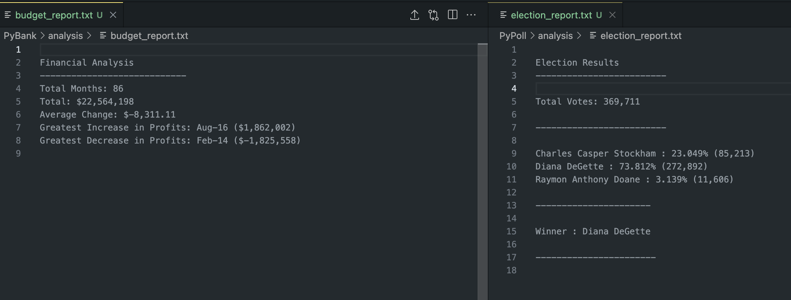

# Python Analysis

## Website: 
[website](https://github.com/mattcat1221/Python_Analysis.com)

## Description
 Created two Python scripts to analyze the financial records of a company and polling results that generated a report for each, providing a summary of the data collected. 

## Table of Contents
- [Installation](#installation)
- [Usage](#usage)
- [Credits](#credits)
- [License](#license)
- [Features](#features)
- [Tests](#tests)
- [Contact](#contact)

## Installation
python, csv library 

## Usage
run the main.py file in the Pybank and the Pypoll folders. 

## Credits
Casey Matthews

## License
MIT

## Features
It provides a summary of budget data and polling data 

## Tests
confirm the budget and election reports are provided.

## Contact
If there are any questions of concerns, I can be reached at:
##### [github: mattcat1221](https://github.com/mattcat1221)
##### [email: caseyvmatthews@gmail.com](mailto:caseyvmatthews@gmail.com)
